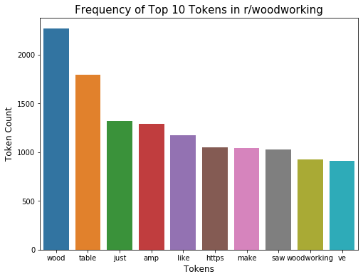
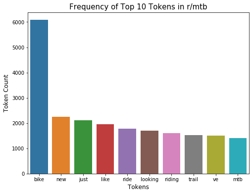

# subbreddit_classification
Using NLP and Classification Models to Predict which subreddit a post came from based on it's title and text

Authored by: Magnus Bigelow

# Problem Statement¶

1) Given the text contained within the title and original post from r/woodworking and r/mtb can we predict which subreddit the post came from with >85% accuracy?

2) Further, using the same model and hyperparameters can we achieve >80% accuracy using the two similar subreddits r/mtb and r/bicycling?

## Data Sources 

The data used for this project was compiled using the PushShift API: 
    [PushShift](https://pushshift.io/api-parameters/)

10,000 most recent post were collected from r/woodworking, r/mtb, and r/bicylcing and the title and selftext (i.e. original post) columns were concatenated into a single 'text' column that was used for our analysis.

## Repo Structure

Reddit NLP - Magnus Bigelow.pdf
- Presentation Summarizing Findings

code
- Folder jupyter notebooks for data collection & EDA, modelling and testing the model on our second set of subreddit's

data
- Folder with csv's from web scrapping

visuals
- Folder with pictures for presentation and choice visuals from analysis

## Executive Summary

For this problem I first utlized the PushShift API to collect 10,000 posts from the r/woodworking, r/mtb and r/bicycling subreddit's. After creating a dataframe containing the posts subreddit, title and selftext, I concatenated title and selftext into a single text column to use for my analysis.  

After this feature engineering I performed some EDA and found 2 interesting charts of the most frequent tokens in the primary 2 target subreddit's: r/woodworking and r/mtb.

A couple interesting notes from these bar plots:
- There is some overlap between the two, largely on tokens that we would expect to be removed by stopwords (i.e. 'just', 'like')
- 'Bike' appears almost 3x as frequently as any token in either subreddit
- Overall token's appear more often in r/mtb which makes since since their median and mean text length was greater than r/woodworking

The next step was to begin modeling. I first set up a pipeline with grid search to find the best Lgistic Regression with a CountVectorizer transformation, the following hyperparameters were optimized:
- CountVectorizer: max_features, stop_words, ngram_range, analyzer (PorterStemmer, Lemmatizer, default)
- LogisticRegression: C, penalty

Using a CV = 5 this pipeline fit 720 models and took over 40 minutes to run so I decided to move forward using the PorterStemmer and Ridge regression which performed the best in order to speed up the process as I didn't have time to wait 40 min for every pipeline to run. 

After running the pipeline and gridsearch again for a logistic regression with a TfidfVectorizer I further simplified my model paramaters going forward as both logistic regressions performed best using (1,1) ngram range, 500 features and no stop words. This allowed me to create standard X variables with both the CountVectorizer and TfidfVectorizer and only Gridsearch over model hyperparameters. This definitely helped keep model run times reasonable, and performance throughout the rest of the models was generally high.

After transforming the variables I ran KNN, Naive Bayes and Random Forest models using both the Count and Tfidf vectorized X variables. To summarize the results:
- CountVectorizer models performed better than TfidfVectorizer Models
- Logistic Regression and Random Forest performed the best
- KNN performed poorly

The performance of the 'winning' models is summarized below.

**Model Performance**
Below we have a table summarizing the performance of the best models that came out of our pipelines on the original two subreddits. We found that generally the logistic regression and random forest models performed very well regardless of vectorizer and naive bayes performed well (ie. >90% accuracy) when using CountVectorizer. Despite being a popular classification and NLP model, our KNN models perfomed poorly using both the CountVectorizer and TfidfVectorizer.

| **Vectorizer**    | **Estimator**             | **Test Accuracy** | **Test Sensitivity** | **Test Specificity** |
|-------------------|---------------------------|-------------------|----------------------|----------------------|
| *CountVectorizer* | *Logistic Regression*     | 0.921             | 0.919                | 0.922                |
| *CountVectorizer* | *KNN*                     | 0.820             | 0.847                | 0.794                |
| *CountVectorizer* | *Multinomial Naive Bayes* | 0.914             | 0.925                | 0.903                |
| *CountVectorizer* | *Random Forest*           | 0.917             | 0.932                | 0.903                |
| *TfidfVectorizer* | *Logistic Regression*     | 0.919             | 0.917                | 0.920                |
| *TfidfVectorizer* | *KNN*                     | 0.737             | 0.787                | 0.686                |
| *TfidfVectorizer* | *Gaussian Naive Bayes*    | 0.737             | 0.999                | 0.475                |
| *TfidfVectorizer* | *Random Forest*           | 0.918             | 0.930                | 0.906                |
| *CountVectorizer* | *Voting (LR, MNB, RF)*    | 0.923             | 0.922                | 0.923                |

**Production Model**
The voting classifier as chosen as our production model as it performed the best of all of the models, even if barely. Additionally, it was expected that it would be more stable in seeing new data as we have 3 different model types acting together so one being over or underfit on a new dataset can be balanced out by the other 2 models. The following hyperparameters were selected for our production model.

**Transformation Hyperparameters**
- Include stop words
- PorterStemmer to stem words
- Single string ngrams
- 500 features

**Model Hyperparameters**
- Sklearn standard LogisticRegression with C=1 and l2 / ridge penalty and liblinear solver
- Standard Multinomial Naive Bayes model
- Random Forest model with 125 tress

Voting Classifier Performance: dissimilar vs similar subreddit's

| **Subreddit = 0**    | **Subreddit = 1**      | **Test Accuracy** | **Test Sensitivity** | **Test Specificity** |
|-------------------|---------------------------|-------------------|----------------------|----------------------|
| *r/mtb* | *r/woodworking*    | 0.923             | 0.922                | 0.923                |
| *r/mtb* | *r/bicycling*    | 0.763            | 0.797                | 0.728               |

## Conclusions

**Problem 1**
We were able to achieve 92% accuracy achieving our goal of >85% classification accuracy.

**Problem 2**
We were unable to achieve 80% classification accuracy with a test accuracy of only 76%

## Next Steps

- Obtain more data
- Train originally on more similar data
- Try different stop word dictionaries to see if they improve the model
- Try additional models
- Multi-class models (i.e. not bernoulli)
